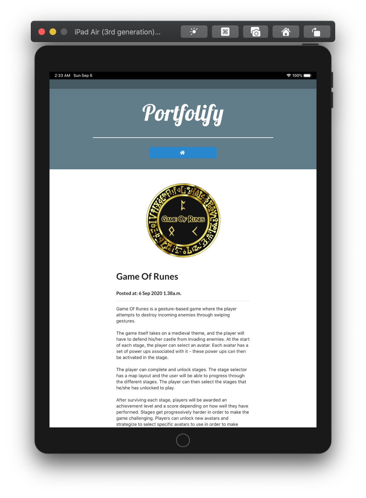
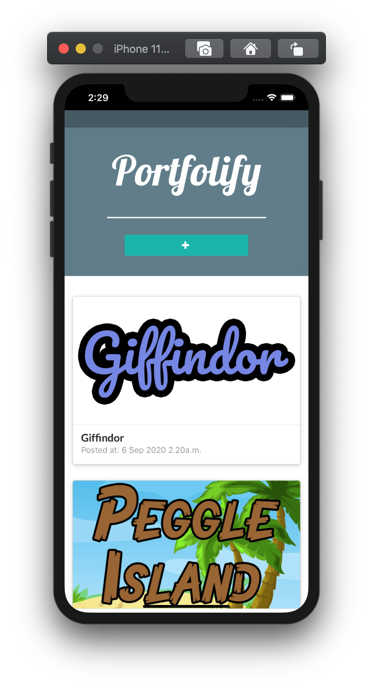
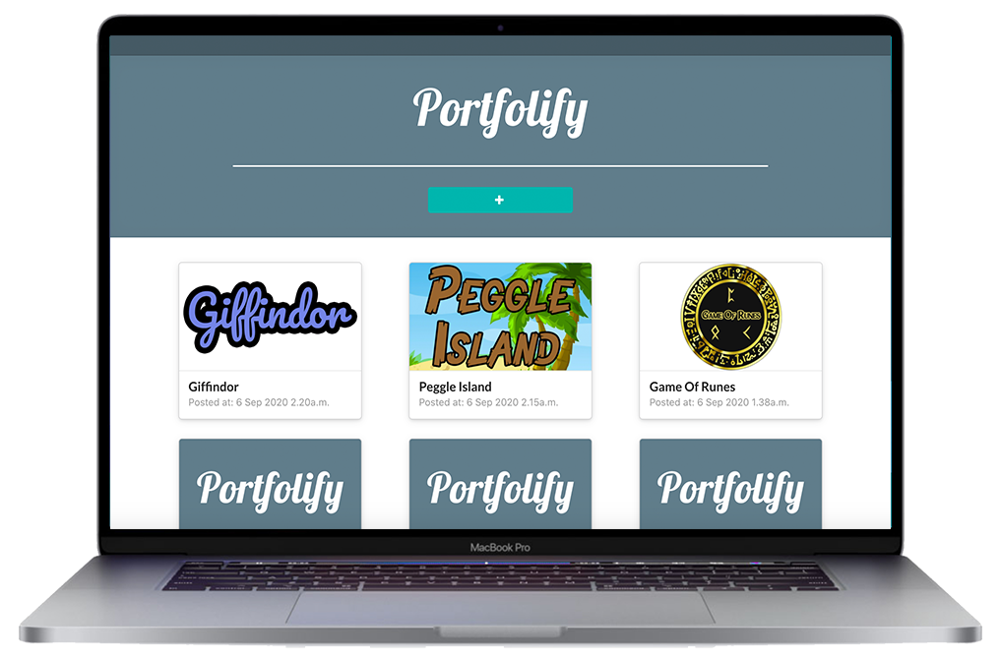

  

  
  
  

# Portfolify

Portfolify is a web app that serves as a portfolio builder for users to create posts and upload images to showcase/share their projects.

## Features

- CRUD posts.
- Image upload.
- Image crop.
- Supports url hyperlinks in post content.
- Responsive. Supports both mobile and desktop view. ​For the full mobile
experience, try installing this webapp to the home screen. E.g. visit the site -> option -> "Add to Home Screen".

## Setup

Instructions to set up the app are located in the READMEs in the frontend and backend folder respectively.
